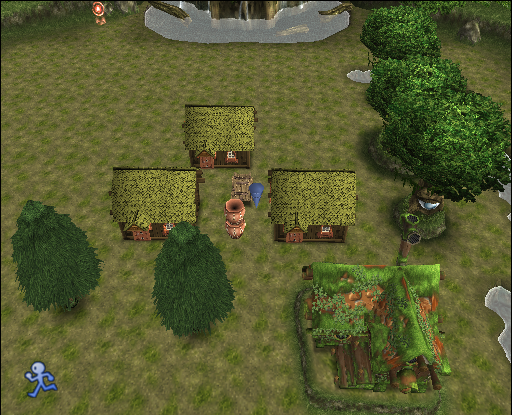
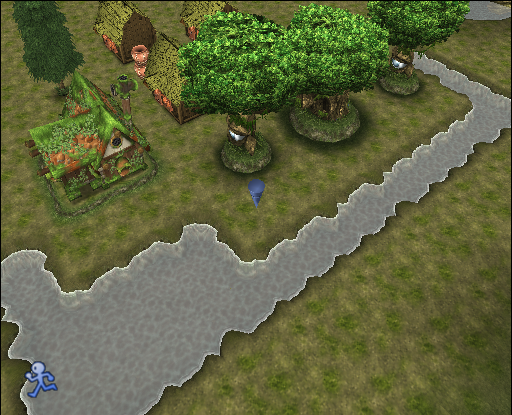
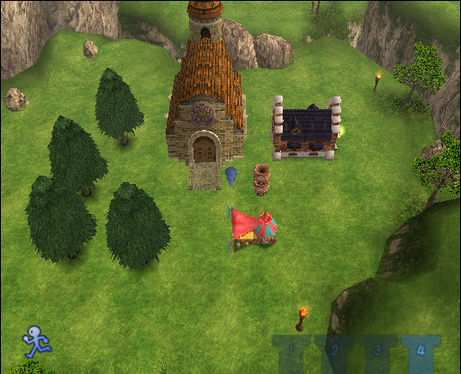
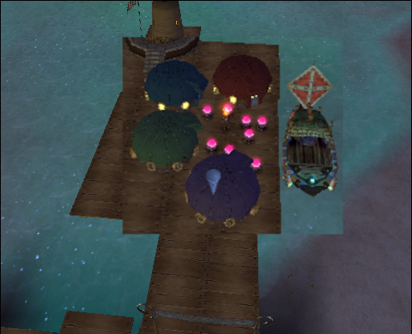
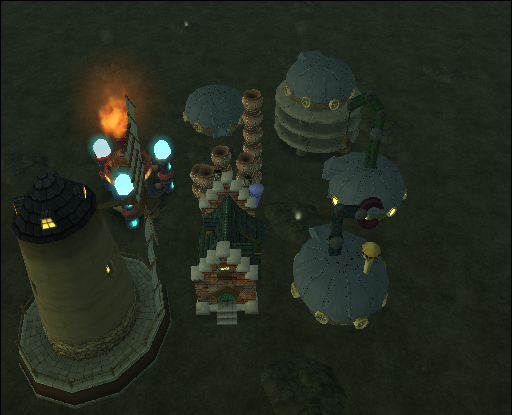
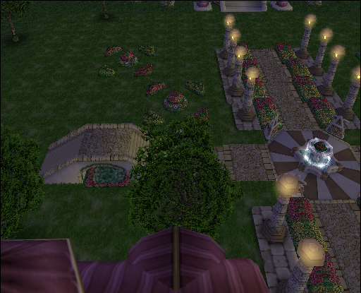
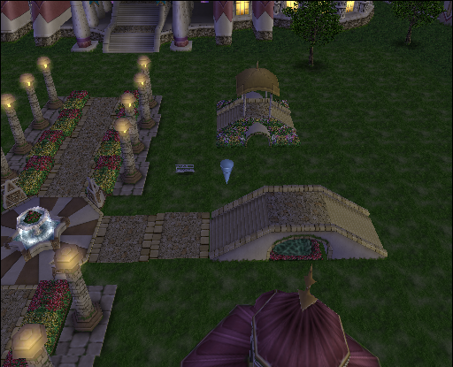
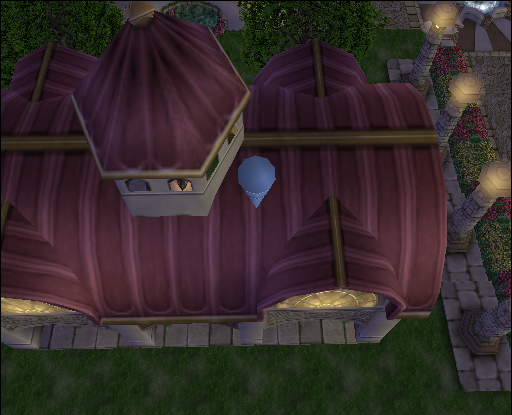
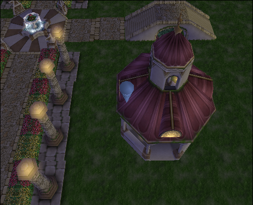

## 序章

電源オンと同時にタイマースタート
オプションで文字速度「はやい」時間経過「はやい」に設定
初めからを選択

初戦闘は適当に連打

レンチとメモ帳回収

受付のピエロにチケットを渡す。

カップル→老人→女の子の順に話す
左回りにぐるっと 女の子は幼女

受付にチケットを渡す
ユリスの初戦闘は
タメ→タメ→通常でまとめて

序章終了。

## １章・外の世界へ

### ダンジョン1

●ゲートキー持ってるモンスター●
	１－１外の世界めざして：ドブチュー
	１－２ねずみたちとの戦い：ドブチュー
	１－３地下水道の亡霊：風船男爵

普通に進む。

---

#### 中ボス・リンダちゃん

１、２回攻撃して逃げ回る。ケツあたりをねっとり見てればOk。

---

### 作業1

イベント後、カメラを装備＆道具整理

ネタ集め。

●写真撮影●
扇風機・木箱・牛乳缶・窓・街灯
太陽・パイプ・ベルト

●作成●
牛乳缶＋パイプ＋ベルト＝バックパック

スターブルに話しかける

アイテムショップで以下の物を購入
●買い物●
鉄くず(２０)
銅のかたまり(２)
ぶあつい皮(１)
スクープメモ(１)

買い物が済んだらバックパックを作成する。

作成したらスターブルに話して物語を進める

---

### ダンジョン2

#### 中ボス・リンダちゃん

リンダちゃんの最初の攻撃が終わったら殴り続けるだけ。

●ゲートキー持ってるモンスター●
	１－４スティーブの闘い：ヴァンガード
	１－５甘くて怖い宝箱：ヴァンガード

#### ボス・ハロウィーン

鼻に爆弾当ててひるませてからスティーブに変えて攻撃する。

#### ボス・ボルカノ

列車での戦いは落ち着いて爆弾３回あてたらおｋ
列車寄りに投げると当たりやすい 
ジャンプの着地狩りをする

モニカ加入＆イベント終了したら１章終了。

## ２章・よみがえる大長老

### イベント1

長老の所に行く
酒とかもらうはず

---

### ダンジョン1

●ゲートキー持ってるモンスター●
　　２－１怖い森：ヒマーラ
　　２－２木の化け物：トーレ
赤　２－３甲羅ごろごろ：ガメロン

ヒマーラの写真を撮ること！

ライドポッド修理＆トム爆弾改作成後シャーロットに行く
※トムは爆弾改を作った後は必ず仲間から外すこと！

イベント終了後、七色蝶の森に行く。

2－１、2－２が終わるまでに
ライドポッドのEXPを４００以上にしておく

2－３はユリス(ライドポッド)が使えないため、
モニカに爆弾改を持たせてガメロンを倒す。

---

### イベント2

怪魚の沼にいったら、丸太に座ってる小人に話しかけて物語を進める。
つり竿をもらったらさっそくつりをする。
餌をもらったら捨てて、再度話しかける
一匹釣れたら、釣竿をくれた小人に話して釣り餌をもらい、もう一度釣りを開始
二回釣りをする理由は、４章で一匹必要なのでまとめてやる

釣りが終わったら物語を進めて、ぬしさまを毒りんごで釣る。
奥の置く側にいるゴリラに話しかけて、湖の真ん中あたりでイベントを発生させる
ぬしさまフラグが立つので釣れるようになる

イベントが終わったらハグハグを渡す

イベントを進めて、シャーロット停車場へ戻る

停車場でライドポッド修理＆ワイン樽キャノン購入
　　　　トムの爆弾改作成をおこない物語を進める

イベントが終わったら、怪魚の沼に行き物語を進める

---

### ダンジョン2

●ゲートキー持ってるモンスター●
　◎２－４これがジオストーン？：パンプキンヘッド
　◎２－５森の騒音：トーレ
青◎２－６ボクはピクシー：ピクシー
　◎２－７伝説の蛇キラースネーク：ギューモ
　◎２－８怪奇！クモババ：ハンターフォックス
白　２－９七色の滝・入り口：ハンターフォックス

特に何も注意点はない 適宜修理と爆弾を入手

---

### 作業1

２－９が終わったら停車場に戻る
イベントが終了したら
設置してあるジオラマ(岩・丸太・草)を回収＆壊す
そして、降りると仲間を集めることが
できるようになるので、ここからしばらく作業します。

移動：シャーロット停車場
ライド修理→トム爆弾改製作→コンダで材料購入1

#### 買い物1

#### 買い物1

**売却**

<ul>
  <li>ライドの武器</li>
  <li>クリスタル(力のクリスタル以外)</li>
  <li>爆弾改(8個)</li>
  <li>ガンリペア・リングリペア</li>
  <li>釣り餌</li>
</ul>
**購入**

| No Polly (Chestnut)  2250 | Polly (No Chestnut)  2790 |
| ------------------------- | ------------------------- |
| 59 **ゴロゴロ丸太**           | 77 **ゴロゴロ丸太**           |
| 3 **丈夫な布**            | 4 **丈夫な布**            |
| 2 **ガラスのもと**          | 4 **ガラスのもと**          |
| 12 **べっとり粘土**            | 8 **べっとり粘土**             |
| 4 Sugar Cane              | 6 Sugar Cane              |
| 6 Forest Dew              | 6 Forest Dew              |
| 10 **鉄くず**        | 12 **鉄くず**        |
| 2 **銀の玉**            | 2 **銀の玉**            |
| 1 Hunk of Copper          | 1 Hunk of Copper          |
| 3 Light Element           | 3 Light Element           |
| 2 Wind Element            | 3 Wind Element            |

移動：バームブリンクス

銅のかたまり・ぶあつい皮を購入・本を撮影
聖水を教会で購入(聖水がある場合はカット)

#### 仲間集め

ゴードン（庭師）を仲間に、木を撮影
おばあちゃん（日中なら）とポーク（マロンがあれば）をリクルート
アデル（服作る人）に材料を渡して、振り向いて電話を撮影
パパの部屋に向かう・途中で噴水撮影
パパの部屋でライフル撮影・パパを仲間に
	ベルトリガー（噴水・電話・木）
	アクアリウム（窓・木箱・噴水）
→ポークをリクルートできていない場合
	向こうの駅に移動→パームブリンクスに移動
	ポリー（パン屋）をリクルート
パーム駅に移動して外に、クレアをリクルート
バーに入って車を撮影

#### ジオラマ

○設置パーツ

| ポリー    | ポーク    |
| --------- | --------- |
| 3  つぼ   | 2  つぼ   |
| 2  木の家 | 3  木の家 |
| 15 川     | リアカー  |
| 目の木1   | 15 かわ   |
| 鼻の木    | 目の木1   |
| 目の木2   | 鼻の木    |
|           | 目の木2   |

○シャーロット　ジオラマ編

　　　　目
　家　　鼻
家リ家　目
　つ
木木小

カルチャーポイントが４０になるはず
左の家 アデル
右の家 ゴードン
上の家 ポリー

このように家を並べ、真ん中にリヤカーと柵を置く。
そうするとなので
木の近くの家にグリン、木の家にルネ、余った家にポリーを移住させる

水水水　　　　　　　
　　水　
　目水　
　　水　
　鼻水
　　水
　目水
　　水
水水水

このように三方向に水路を敷き、目と鼻を囲めたらおk

これで完成度が60％になればジオラマ終了

ジオラマが終わったら、
鼻の木を撮影
お店が出来るまで未来と過去を行き来する

#### 買い物2

　購入
ヒマーラバッジ
金色の絵の具
とんがりマロン	ポークをリクルートできていない場合
にんじん
ダークコイン	2枚買う
不滅のコイン

合計１８８０Ｇ

---

### イベント3

つづらを回収しつつ、現代に戻る
移動を使い、七色蝶の森２－１(怖い森)へ

ヒマーラに変身して、敵ヒマーラに話しかけると太陽の雫をゲット
金策調整していたら、移動でダンジョン脱出
調整していない場合は普通にダンジョン攻略する

七色の滝へ向かい、池の前でラフレシアの種→太陽のしずく
を使いラフレシアを成長させる

ラフレシアのくきを撮って、つづらの成長アイテムを使う！
イベントを進めボス戦へ

---

### ボス・七色蝶

まずユリスで真ん中の触手を全て叩く
すると蝶が七匹に分裂するのでライドポッドに変更し、
赤色→オレンジ→黄→緑→水→青→紫　の順に倒す
右回りか左回りか

---

### イベント4

イベントを挟み、移動できるようになったらシャーロットに行く
アデルと木を回収　ポークも置いてたら

イベントが終わったら、スターブルに話し　てんびん谷へ

てんびん谷に行ったらイベント
イベント後、目の前にある家に入りイベント

---

### 作業2

地下水路に移動してドニーをリクルート
パームブリンクスでつづら回収
教会でブルーノ（神父）
	４　・
	・　・
	・　３
	・　・
	２　・
	・　・
	・　1
	
パトリをリクルートして、2階のペンキも回収
リクルートできていなければ
	おばあちゃん
	ポーク
診療所でダック先生をリクルート

仲間集めが終わったらてんびん谷へ移動してリンの家に入る

## ３章・星になった賢者

ドニーをダンジョンに連れて行く

### ダンジョン1

●ゲートキー持ってるモンスター●
　◎３－１　突猛進　　　　　　　　　　　　鬼面族
　◎３－２　炎と冷気は不仲です　　　　　　エレフゥス
　　３－３　大地を震わす魔物　　　　　　　スタチュードッグ
　　３－４　強敵！ヨーヨーロボ　　　　　　Ｔ・ジェムロン

攻略したら停車場に戻り、トム爆弾生成
スターブルと話し、修理→ワイン樽キャノン購入

これらが終わったら、Aショップに行き封印解除の巻物を二つ購入
買えそうなら4つ購入しておく
5つかも……

●ゲートキー持ってるモンスター●
赤　３－５　谷の象軍団　　　　　　　　　　エレフゥス
　　３－６　危険な宝箱　　　　　　　　　　エレフゥス
青◎３－７　チビ竜軍団の逆襲　　　　　　　Ｆ・ジェムロン
白　３－８　強敵登場！渓谷の戦士　　　　　エレフゥス
　◎３－９　ワライボックルの里　　　　　　Ｆ・ジェムロン

最初は月を攻略
３－９まで攻略できたら、停車場に行きトム爆弾生成＆ライドポッド修理
これが終わったら材料購入へ

---

### 作業1

#### 買い物1

必要個数
・赤、青、緑を各10	パトリから買うので後で
・ゴロゴロ丸太　（36）
・ガッシリ石　　（１６）
・意外と丈夫な布　（３）
・火薬（15）
・ガラスのもと 　（７）
・べっとり粘土　　（12）
・森のしずく　　（１3）
・鉄クズ　　　　　（1５）
・聖のエレメント　（１）
・土のエレメント（１3）
・水のエレメント（１4）
・火のエレメント　（２）

買い物が終わったら、てんびん谷へ行きジオラマ作成へ

#### ジオラマ1

○設置パーツ
2 つぼ
トゲトゲの木×１3
レンガの家×１
中華屋台×１　
星のランプ×１
教会×１

○てんびん谷　ジオラマ編

1じゃなくて4に家々は配置
　　　１
　　教会
　　中華屋台
レンガの家(むらさき)

　　　３　　　　　　　　　４
　　木×11　　　　　　　木×4

・レンガの家はむらさきにペイントしておき、ランプをつける
・教会にブルーノ神父・中華屋台にポーク・レンガの家にパトリを移住
・パトリを移住させたら中に入ってペンキ（赤・青・緑×１０）を購入

　これで完成度が５０％になればジオラマ終了

---

### イベント1

未来に行きイベント
移動できるようになればラオチャオ飯店に行く
暴れ龍と北京ダックを撮影
マシンガン（扇風機+ライフル+暴れ龍）を作成

イベント終了後、現代に戻りステラ渓谷(ボスの谷)へ

手頃な枝を取り、モニカに話す
会話イベントの選択肢は必ず「いいえ」
モニカに話すと諦めるかどうかを聞かれるので諦める方を選択

イベント終了後ダンジョンを出て未来に行く
ラオチャオ飯店で白き風の花を渡し、現代へ

リンの家に行き焼売を渡すとイベントでリンが仲間になる
仲間になったら未来に行き、スターアイテムズで買い物

星の砂時計と力のクリスタル×２（持ってたらカット）を購入
買い物が終わったら、つづらを適当に回収しつつ現代へ
改良された爆弾は8個は残しておくこと

---

### ダンジョン2

●ゲートキー持ってるモンスター●
　　３－１０呪いの面　　　　　　　　　　　Ｔ・ジェムロン
　　３－１１オレたちゴロゴロブラザーズ エレフゥス
　　３－１２ドラゴンスレイヤー　　　　　　ドラゴン
　　３－１３カナリア司祭はチーズがお好き エレメントヒューン
　　３－１４自然の脅威　　　　　　　　　　ドラゴン
　　３－１５月の男爵　　　　　　　　　　　Ｈ・ジェムロン
　　３－１６灯台が見えてきた　　　　　　　ドラゴン

#### 中ボス戦・メムイータ

ライドに変えて適当に打てば終わる
最弱に近いボス

ボス倒したらそのまま進み、最後までダンジョンを攻略
３－１６まで終わったら、セーブして峠の灯台へ

峠の灯台で星の砂時計を使うとイベント
イベント後ボス戦へ

#### ボス戦・ギルトーニ＆邪悪な炎

戦闘はギルトーニ→邪悪な炎→ギルトーニ→邪悪な炎→ギルトーニ
と交互に戦う

ギルトーニはモニカで戦わないといけないので爆弾改を使って戦う
まず防御しながら近づく、
すると攻撃してくるのでカウンターで爆弾を投げればおk

要するに、ギルトーニが攻撃→爆弾を1個投げる→繰り返し
必ずターゲット選択してから爆弾を投げること！

ギルトーニのＨＰが減ると主人公が変わる
3発→2発→3発当てたら終了

爆弾は外しやすいので慎重に。爆弾が尽きたらリセット　

邪悪な炎はライドに変えて打てば勝手に追尾してくれるので楽
たまが尽きたら回復

目標は爆弾１０発以内

ボスを倒したらイベント
移動できるようになったら過去に行きイベント
終わったらスターブルに話し、ペニーティオへ

着いたら、ライド修理・爆弾作成・ボルテオを仲間にして進む

## ４章・さよなら　シグー

移動できるようになったら、パウの家へ直進
イベント後ダンジョンへ

●ゲートキー持ってるモンスター●
　◎４－１　海賊あらわる！　　　　　　　ゲロン（×4）
　　４－２　魚だらけ　　　　　　　　　　ゲロン（×4）
青◎４－３　戦車と親方　　　　　　　　　ビーチラット（×4）
　　４－４　水のモンスター　　　　　　　ビーチラット（×4）
　◎４－５　恐怖！メドゥーおばさん　　　ゲロン（×6）
　　４－６　海のもぐら　　　　　　　　　サンドモーラー（×8）
　　４－７　コウモリの巣窟　　　　　　　メドゥーおばさん（×4）
　　４－８　海賊たちのアジト　　　　　　シーバァー（×2）
　　
古代壁画の洞窟までいったらイベント
移動できるようになったら作業タイム開始

移動：ペニーティオ停車場
・ライド修理＆ライドコアパワーアップ
	バレるパックも買っちゃう
・トム爆弾改製作
・コンダで材料購入
・アクアリウムを発明・作成　(木箱＋噴水＋窓)
・魚をアクアリウムに入れる

移動：シャーロット
未来に行き鉄壁のコインと暗黒のコイン購入

移動：パームブリンクス
Aショップでぶあつい皮×８と封印解除の巻物×１を購入
地下水道に行きつづら回収＆ドニーを仲間にする

これらが終わったら、ペニーティオへ行きジオラマ作成へ

○設置パーツ材料
　　　　　　　必要個数
・ゴロゴロ丸太　（５９）
・ガッシリ石　　（4）
・ワラの束　　　（2）
・意外と丈夫な布（６）
・ガラスのもと　（２４）
・べっとり粘土　（４）
・鉄クズ　　　　（118）　
・光のエレメント（８）
・水のエレメント（１５）
・風のエレメント（１）
・火のエレメント（16）
　合計４９２０ギルダ

○設置パーツ
つぼのたいまつ×１
浅橋×８
鉄の家×４
ボート×１

○ペニーティオ　ジオラマ編

1回目

　　橋橋
　　橋橋
　　橋橋
　船橋橋

・船の近くに鉄の家を４つ置く
　少しあいだを開けて配置すること！
・４つの家にペイント（赤・青・緑・紫）
・４つの家の真ん中につぼのたいまつ
・赤の家にクレア

1回目が終わったら未来に行きストーリーをすすめる
未来に行ったら赤い建物に入りイベント

アクアリウムに入ってる魚に電気ミミズをあげて
つづらを回収（３つ？）しながら現代に戻る
	エネルギーパイプを撮る事

移動：古代壁画の洞窟
イベント後シグーとバトル

☆ボス戦　シグー
ライドでＨＰ半分減らし　口を開けたら電気ミミズを投げればおk

●ゲートキー持ってるモンスター●
白　４－９　さすらいのビリー　　　　　　エレメントビリー（×2）
　　４－１０死霊のうたげ　　　　　　　　サンドモーラー（×4）
赤◎４－１１改良されたあいつ　　　　　　ヴァンガード改（×4）
　　４－１２また出た！伝説の海蛇　　　　サンドモーラー（×4）
　　４－１３呪われし海　　　　　　　　　ヴァンガード改（×4）
　◎４－１４惨劇の海　　　　　　　　　　エレメントビリー（×6）

イベントが終了したら再びダンジョン攻略へ
４－１４まで攻略したらジオラマ2回目開始

2回目
・作成物
ルナストーン×８
風車×１

・ルナストーンを８つ鉄の家の間に置く
　cp８０超えたらおk
・風車を端っこに置く
	風車の羽を写真に撮る事
タック発明（木+北京ダック+風車の羽根）
　青の家にドニーを移住させる

2回目が終わったら未来に行き、青い建物に入りイベント
現代に戻り　移動：シーグラの村

シーグラの村で長老（色違いのやつ）と話す
パウの家に行き、シグーに薬を渡す

再びシーグラの村に行くとボス戦

☆ボス戦　Dr.ジャミング
ボスがぐるぐるしているので、シーグラたちをタイミングよく殴り
当ててダメージを削る

ボス撃破後イベント
未来に行くとペズキャノンがもらえる
センターラボ周辺を回りつづら回収
右側に沿って歩く
（パイ・パフェ・りんご）×１　（宝石）×３
サファイアは売ってもいいけどペリドットは売っちゃダメ
センターラボに行くとイベント

スターブルに話し、ヘイム・ラダへ

## ５章・決戦！過去と未来と

移動できるようになったら
・スターブルと話し、修理＆コア更新
木製ボックスボディ買うのあり
	日本刀もアリだと思う
・ペニーティオに移動してパウを仲間にする（必：にんじん）
・ペニーティオ未来に行き写真撮影(サーチライト・システム５ＷＰ２)
・停車場に移動してトム爆弾生成
・パウを連れて行く
これらが終わったらヘイム・ラダへ

バギー作成（ベルト + 車 + システム5WP2）

イベント後、ダンジョン攻略へ

●ゲートキー持ってるモンスター●
　◎５－１　グリフォン軍との戦い　　　　　スナイパーウルフ（×6）
赤◎５－２　ガンドールの風　　　　　　　　スチームトーレ（×2
　　５－３　山のチビ竜たち　　　　　　　　Ｃ・ガンドロン（×4）
青　５－４　スチームギョーン　　　　　　　スナイパーウルフ（×6）
　◎５－５　出現！山の暴れん坊　　　　　　スチームトーレ（×2）	スフィーダの報酬で盗むコイン
　　５－６　赤いイワノフ　　　　　　　　　暴れトッシーン（×6）
　　５－７　危険地帯　　　　　　　　　　　グリフォン軍兵士（×6）
　　５－８　火の山の秘密　　　　　　　　　スチームトーレ（×2）	盗むコインフロア（？）
　　５－９　デストラップ　　　　　　　　　グリフォン軍兵士（×6）
　　５－１０決死の八合目　　　　　　　　　スナイパーウルフ（×2）
　　５－１１うっとうしいやつら　　　　　　スチームトーレ（×4）
　　５－１２炎の道をゆく　　　　　　　　　キマイラ（×2）
　　５－１３爆炎のアンデット　　　　　　　溶岩ランナー（×6）
白　５－１４ファイヤードラゴン　　　　　　キマイラ（×4）
　　５－１５宝箱危険ゾーン　　　　　　　　ガシャス（×4）
　　５－１６炎の川に続く道　　　　　　　　レッドドラゴン（×6）
　　
５－１１まで攻略したら作業タイム開始
	できる限り最後まで進めてよい

移動：ヘイム・ラダ停車場
・ライド修理
・コンダで買い物
・トム爆弾生成
・パウ連れて行く

○設置パーツ材料
　　　　　　　必要個数
・ゴロゴロ丸太　　（４）
・ガッシリ石　　　（６１）
・丈夫な布　　　　（２）
・ガラスのもと　　（８）
・べっとり粘土　　（７６）
・鉄クズ　　　　　（１０６）
・銅のかたまり　　（４）
・土のエレメント　（１０）
・雷のエレメント　（４）
・風のエレメント　（１）
・火のエレメント　（１０）
合計５７８０ギルダ

| Heavy Hammer  9520  | Steal Gun   11720   |
| ------------------- | ------------------- |
| 4 **ゴロゴロ丸太**      | 4 **ゴロゴロ丸太**      |
| 37 Sturdy Rocks     | 32 Sturdy Rocks     |
| 2 **丈夫な布**      | 2 **丈夫な布**      |
| 22 **ガラスのもと**s  | 22 **ガラスのもと**s  |
| 64 **べっとり粘土**      | 64 **べっとり粘土**      |
| 136 **鉄くず** | 106 **鉄くず** |
| 10 **銀の玉**     | 20 **銀の玉**     |
| 4 **銅のかたまり**   | 4 **銅のかたまり**   |
| 10 Earth Element    | 10 Light Element    |
| 44 Thunder Element  | 10 Earth Element    |
| 1 Wind Element      | 44 Thunder Element  |
| 3 Fire Element +10 | 1 Wind Element      |
|                     | 3 Fire Element +10  |

9 **銀の玉**
15 光のエレメント
20 銅の塊

○設置パーツ
・つぼ×１０
・鉄の煙突×１
・レンガの家
・鉄の台×３
・鉄の家×3
・風車×１
・発電機×１
・グレートクレーン×１
・パワーアーム×１

買い物が終わったらジオラマ開始

○ヘイム・ラダ　ジオラマ編

　　　　　　家　
　　　　　[鉄台]
　　　　　[鉄台]
　家家壺　[鉄台]壺　家＜　煙突・クレーン・アーム

　　発電機　　　風車

・鉄の台を3つ重ねて上に家を置く
・上の家の近くに壺を5個重ねたものを２つ近くに置く
・壺の近くに家を３つ置く
・1つの家に煙突・クレーン・アームをつけ、ボルネオを移住させる
・風車と発電機を適当に置く
・低いところにある家にジラード・高いところにある家にスターブルを移住させる
・◇つぼ・発電機・パワーアームを撮影
・タンクつぼ式（つぼ・エネルギーパイプ・発電機）を発明＆作成
・バギー(システム５ＷＰ２＋ベルト＋車)を発明＆作成

ジオラマが完成したら未来に行く
・近くにあるゲートで移動、場所は東
・エレベーターで２階にいけばイベント
・２階にあるライドショップに行き、ドラム缶を撮影
・現代へ戻る

現代に戻ったらダンジョン攻略へ
・ガンドール火山　山頂で時限爆弾を使いボス戦

☆ボス戦　デスアーク
ライドに変え本体を狙いながら左右に逃げ回ればおk

・５－１６まで終わったら未来に行く
・近くにあるゲートで移動、場所は北
・エレベーターで３階に行き近くの建物の中に入ればイベント
・現代へ戻る

現代に戻ったら、ガンドール火山　火口に行く
・ファイアーホーンを使い進むとボス戦

☆ボス戦　ギルトーニ
逃げながら打てばおk

・ボス撃破後しばらくイベント

イベントが終了したら未来へ
撮影
	パズノス
	作業クレーン
発明
	ヘビーハンマー（ドラム缶・パワーアーム・パズノス）
	スティールガン（本・噴水・作業クレーン）
合成
	ペリドットをハンマーに
	スティールガンを入手済ならダークコインを合成

・近くのゲートでブリッジに移動
・ドナホーンと話しイベント

移動できるようになったら、ペニーティオの未来へ
・センターラボに行きイベント

## ６章・二つの時代、重なるとき

移動できるようになったら、ステータスアップアイテムを使用
その後セーブする
・セーブが終わったらイベント進める
・月花宮殿に入るとボス戦

☆ボス戦　？？？？（グリフォン）
ここまでの敵と違って強敵
ヘビーハンマーに装備を変えて戦うこと
相手が近づいてきたら、1回殴って防御
攻撃してきたら３回殴って防御

受けるダメージは２０前後（防御アリ）
回復はカリカリパンでＨＰ２５以下になったら防御
目標は3分半切り

ボス撃破したらイベントラッシュ
※途中で少し移動しないといけない部分があるので注意

移動可能になったら、少し作業
・ヘイムラダにいるスターブルを列車に戻す
・コンダのところで買い物
・トム爆弾生成
・ライド修理
・パウを仲間にする

○コンダの材料屋
：売るもの
・爆弾改（全て）

：買うもの　　　必要個数　
・べっとり粘土　（１２）
・聖のエレメント（５０）
・火のエレメント（２０）
合計４４４０ギルダ

これらが終わったらダンジョン攻略へ

●ゲートキー持ってるモンスター●
青　５－４　スチームギョーン　　　　　　　スナイパーウルフ（×6） 　
　　５－１７炎の山に隠されしもの　　　　　レッドフォックス（×6） 　
　　５－１８ばくだん温泉　　　　　　　　　スピリットボウ（×4） 　
　　５－１９狂った山　　　　　　　　　　　フレイムネイル（×8）

　　２－７　伝説の蛇キラースネーク　　　　ギューモ（×5） 　
　　２－１０大地に眠る宝珠　　　　　　　　スピリットヒューン（×6）
青　２－１１レアここにあり！　　　　　　　マッドトーレ（×4） 　
　　２－１２木が怖い　　　　　　　　　　　マッドトーレ（×6） 　
　
　　３－１０呪いの面　　　　　　　　　　　Ｔ・ジェムロン（×2） 　
　　３－１７風の宝珠をもとめて　　　　　　バラーラ（×12） 　
　　３－１８谷に住む魔性　　　　　　　　　バラーラ（×6） 　
青　３－１９谷のつわものたち　　　　　　　ブルーモ（×6）

白　４－９　さすらいのビリー　　　　　　　エレメントビリー（×2） 　
　　４－１５海に眠る宝をさがせ！　　　　　スターガメロン（×4） 　
　　４－１６海賊たちの復讐　　　　　　　　ファットナーガ（×6） 　
赤　４－１７デスオーシャン　　　　　　　　アーケラス（×4）

風の所を攻略して祭壇を撮影
マシンガンアーム作成（ドラム缶・プロペラ・風の祭壇）

火の所をクリアしたら住民を回収

途中赤封印があるが爆弾改で対処する

ラピスを回収したらカザロフストーンヘンジへ
全てのラピスをはめるとすごい長いイベント（スキップ10回以上）

移動できるようになったら月花宮殿庭園へ向かう

## ７章・花の宮殿

イベントが終わって移動できるようになったら
・トム爆弾生成
・ライド修理
・パウを仲間にする
終わったらダンジョン攻略へ

●ゲートキー持ってるモンスター●
　　７－１　古代の風　　　　　　　　　　　キャッスルイーター（×6）
　◎７－２　トランプ戦士集結　　　　　　　クローバー（×5）
　　７－３　危険な宝　　　　　　　　　　　エビルパフォーマー（×6）
　　７－４　ゾンビ地帯　　　　　　　　　　キャッスルイーター（×6）
白◎７－５　違和感　　　　　　　　　　　　キャッスルイーター（×6）
　　７－６　リビングスタチュー　　　　　　ムーンギョーン（×6） 　
　　７－７　デンジャラスゾーン　　　　　　ストーミィー（×2） 　
　◎７－８　女は怖い　　　　　　　　　　　ムーンギョーン（×6）
　　７ー９　地獄のエレファント　　　　　　月花象（×1） 　
　◎７－１０不死の敵を討て　　　　　　　　エビルパフォーマー（×6）
　◎７－１１消えた宝石商　　　　　　　　　ストーミィー（×1）
青◎７ー１２ユリスの一番長い日　　　　　　Ｆ・ドレイク（×4）
　◎７－１３地獄回廊　　　　　　　　　　　月花象（×2）
赤◎７－１４ひとりぼっちのモニカ　　　　　ガーディア（×4）
　◎７－１５荒れ狂う精霊たち　　　　　　　サンダーゴースト（×4）
　　７－１６ロンリーマシン　　　　　　　　ヴァンガードII（×2） 　
　　７－１７高貴なる者　　　　　　　　　　ストーミィー（×2） 　
　◎７－１８城の番犬　　　　　　　　　　　ヴァンガードII（×6）
　　７－１９思い出へ続く道　　　　　　　　ライオグリフ（×2） 　
　◎７－２０最後の切り札　　　　　　　　　Ｓ・クローバー（×4）
青　７－２１エレメンタルパーティ　　　　　ヴァンガードII（×6） 　
　　７－２２さまよえる騎士の魂　　　　　　リッチ（×4） 　
　　７－２３油断大敵　　　　　　　　　　　ヴァンガードII（×4） 　
白　７－２４最後の闘い　　　　　　　　　　アースドラゴン（×4）

最後のところで花のシャンデリアを撮影
ツインバスター作成（花のシャンデリア・ライフル・ジュラクのハナ）
時止め対策のお札・回復アイテム・ファイナルボムを購入
ボムはいくつあっても問題ない

ツインバスターにダークコイン

| 銃6240を盗む           | ツインバスター8740     |
| ---------------------- | ---------------------- |
| 2ローリングログ        | 2ローリングログ        |
| 52丈夫な岩             | 52丈夫な岩             |
| 38ラフロックス         | 38ラフロックス         |
| 2ガラス素材            | 15火薬                 |
| 1ゴールドバー          | 2ガラス素材            |
| 3ライトエレメント      | 金属くず20個           |
| 16聖なる要素           | 3つのゴールドバー      |
| 15アースエレメント     | 3ライトエレメント      |
| 18ウォーターエレメント | 16聖なる要素           |
| 2風要素                | 15アースエレメント     |
| 2生命要素              | 18ウォーターエレメント |
|                        | 2風要素                |
|                        | 2生命要素              |

○設置パーツ
・ペトルの川×２
・憩いの噴水×１
・悲しみの回廊×１
・星くずの池×１
・星影の階段×２
・フロール花壇×2
・アーカサルの階段×１
・月の柱×１６
・銀のベンチ×１
・コルバドの道×８
・道×４
・シャラの木×２

○月花宮殿庭園　ジオラマ編

※停車場を手前・エントランスを奥に見た場合の設置なので注意！

　　　　　　　柱 コ道 柱　　べ　
　　　　　　　柱 コ道 柱　　ン ア階段
　　　花壇　　柱 コ道 柱　　チ
　　　花壇　　柱 コ道 柱
道　　階段　　道 噴水 道 　階段　　道　
　　　 川　　 柱 コ道 柱　　 川
　　木　　木　柱 コ道 柱　　花壇
　　　　　　　柱 コ道 柱　　 池
　　　回廊　　柱 コ道 柱

・真ん中に噴水を置く
・噴水の上下にコルバドの道を４つずつ置く
・コルバトの道の両脇に月の柱を敷き詰める
・噴水の左右に道・階段・道の順番に設置
・階段の下に川を１つずつ設置
・右下にフロール花壇・星くずの池の順番に設置
・右上にアーカサル階段を設置　その横にベンチを設置
・左下に木を２個並べてその下に悲しみの回廊を設置
・左上にフロール花壇を二つ縦に並べる

ジオラマが100％になればおk
下に降りるとイベント

イベントが終わったら最終調整
・月花宮殿エントランスへ行きつづらを全て回収＆使用

セーブが終わったら、月花宮殿の最後のフロアへ
奥の扉で名前をいいラスボス連戦へ　名前は「サン」

☆ボス戦　グリフォン大帝

このボスは第三形態まであり強敵

・第１形態
先頭が始まったらすぐにファイナルボムを投げる
うまくいけば瞬殺できる

もしよけられてしまったら、ライドに変えて
グリフォンの周りをぐるぐるしてる奴を狙い攻撃

・第２形態
ユリスで避けつつ爆弾改を当てるだけ

・第３形態
お金を貯めて買ったファイナルボムをここで投げつける
石化状態になったらメドゥーサの涙を使うこと

無事に倒せたらイベントラッシュ
イベントが終わったら再びボスラッシュ

☆ボス戦　５連戦
すべてライドのレーザーアームⅢで攻撃すればおk

☆ボス戦　ダークエレメント
真のラスボス！

・胸が青の時
ユリスのヘビーハンマーでちまちま攻撃
そこまで無理しなくていい

・胸が赤の時
ダメージを与えられないので防御しながら逃げる

・巨大化の時
ライドに変え全力で攻撃（○連打）

綺麗にいけば3分切ったくらいで撃破できる
撃破したら感動のエンディング